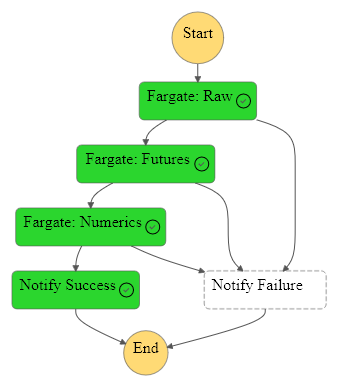

**Links**

* [The Artificial Intelligence Unit](https://github.com/theartificialintelligenceunit)

 

<b>Notes</b>

  

 
 

 
 

 
 

 
 

<!--

<b>Notes</b>

  
<h3>BACKEND</h3>
Thus far:
<ul>
  <li>configurations: For modelling, etc.</li>
  <li>iac: Infrastructure as code scripts.</li>
</ul>

<h3>STATE MACHINES</h3>
Include:
<ul>
  <li><b>references</b>: [on demand] For decoding within-data identification codes, e.g., health board codes, etc.</li>
  <li><b>raw</b>: [weekly] Once a week it retrieves the latest [version of] raw counts of weekly accident & emergency attendance numbers.  It saves an appropriate structure.</li>
  <li><b>futures | parts</b>: [weekly] Forecasting</li>
</ul>

-->

