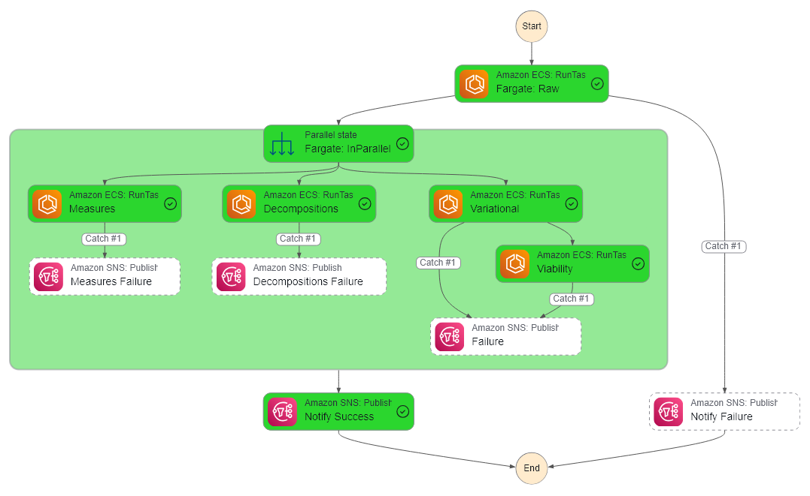

[The Artificial Intelligence Unit](https://github.com/theartificialintelligenceunit)

 

### Modelling Details

&nbsp; | description
:--- | :---
task | River Level Prediction
algorithm | Bayesian Structural Time Series (STS) + Variational Inference
input | The accident & emergency attendance time series of the previous weeks.
output | The training phase forecasts, the testing phase predictions, and future predictions (9 weeks ahead)
operations schedules | The raw data is updated weekly, and sometimes data numbers are corrected, hence <ul><li><b>Predictions</b>: Weekly, Tuesdays, 9 Weeks Ahead</li><li><b>Model Re-training</b>: Weekly, Tuesdays, Before Predictions</li></ul>

<b>Notes</b>

   <a href="https://theartificialintelligenceunit.github.io/intelligence/html/pre-ae-futures.html">APP</a> 
  
  
  

 
 

 
 

 
 

 
 

<!--

<b>Notes</b>

  
<h3>BACKEND</h3>
Thus far:
<ul>
  <li>configurations: For modelling, etc.</li>
  <li>iac: Infrastructure as code scripts.</li>
</ul>

<h3>STATE MACHINES</h3>
Include:
<ul>
  <li><b>references</b>: [on demand] For decoding within-data identification codes, e.g., health board codes, etc.</li>
  <li><b>raw</b>: [weekly] Once a week it retrieves the latest [version of] raw counts of weekly accident & emergency attendance numbers.  It saves an appropriate structure.</li>
  <li><b>futures | parts</b>: [weekly] Forecasting</li>
</ul>

-->

